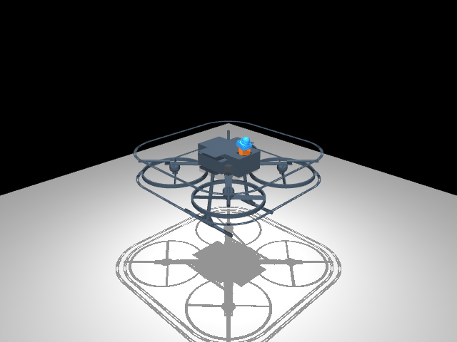
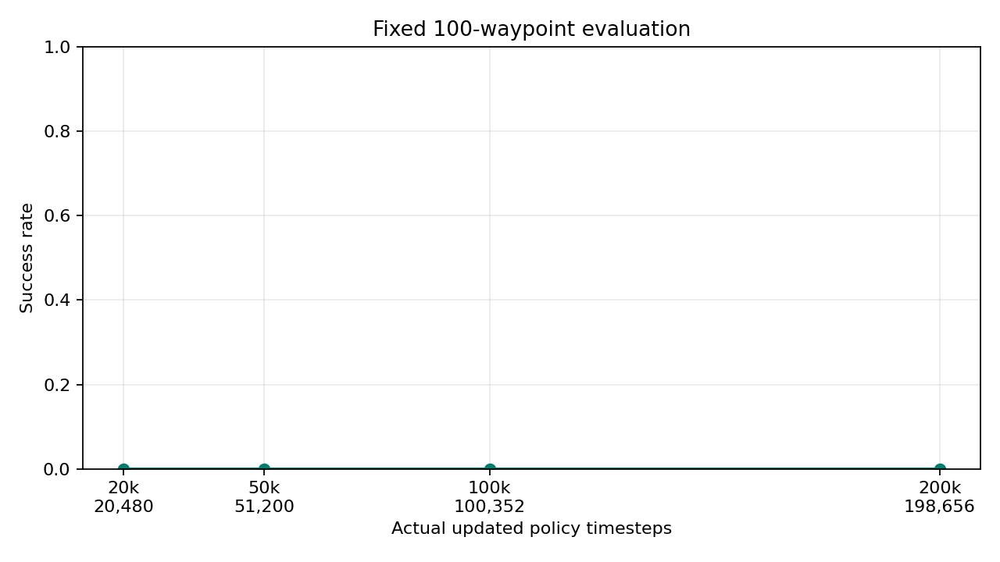
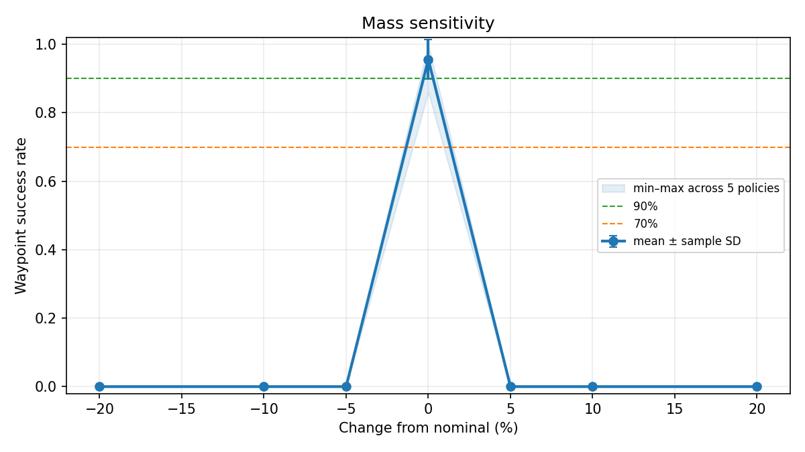
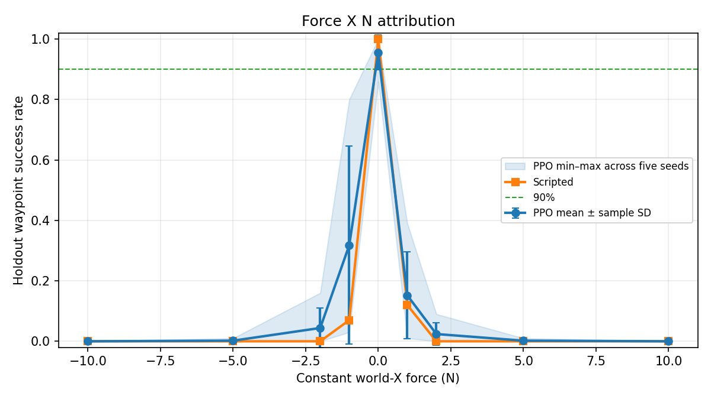
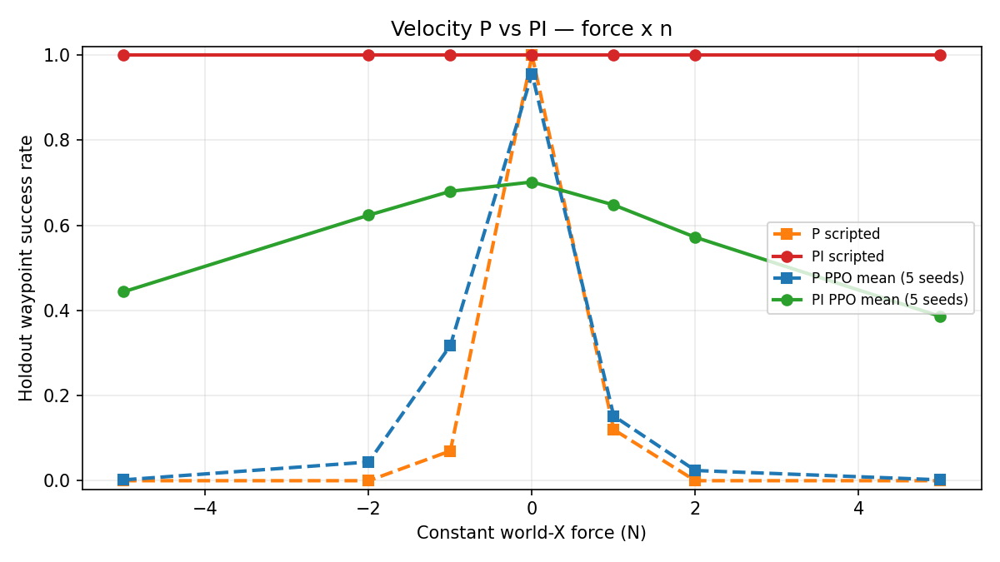

# MineUAV-Learning

**面向约 7 kg 矿井无人机的机器人学习、飞行控制与 Sim2Real 项目**

MineUAV-Learning 是一个围绕真实矿井无人机建立的机器人学习与强化学习项目，核心基于具有物理参数约束的 MuJoCo 动力学模型。

当前系统结合了 **无人机动力学、经典级联控制、Gymnasium、PPO、鲁棒性分析、扰动抑制和部分可观测性研究**。长期目标是通过 **ROS2 / PX4** 部署到真实无人机，并进一步扩展到 **LiDAR / 视觉策略、World Model 和 World Action Model（WAM）**。

<p align="center">
  
</p>

---

## 系统架构

```text
目标点 / 导航目标
          │
          ▼
┌─────────────────────────┐
│ PPO 高层策略             │
│ Observation → Action    │
│ 状态 → 速度指令          │
└────────────┬────────────┘
             │
             ▼
┌─────────────────────────┐
│ 速度控制器               │
│ P / PI                  │
└────────────┬────────────┘
             │
             ▼
┌─────────────────────────┐
│ 姿态控制器               │
│ 四元数反馈               │
└────────────┬────────────┘
             │
             ▼
┌─────────────────────────┐
│ 控制分配器               │
│ Fz / Tx / Ty / Tz       │
└────────────┬────────────┘
             │
             ▼
┌─────────────────────────┐
│ MuJoCo 矿井无人机        │
│ 4 电机 + 刚体动力学      │
└─────────────────────────┘
```

RL 策略**不直接控制四个电机**。

策略输出高层控制指令：

```text
[vx_cmd, vy_cmd, vz_cmd, yaw_rate_cmd]
```

底层姿态稳定与控制分配仍由经典控制器完成。

这种分层架构的目的，是让学习策略更容易训练、更容易诊断，同时也更方便未来接入 PX4。

---

# 关键结果

## 1. PPO 航点学习

最初的 PPO 策略能够飞向目标点，但会反复越过目标，无法稳定停靠。

经过一系列受控诊断后，主要问题最终被定位到**连续动作空间的探索噪声尺度**。

SB3 PPO 的连续动作策略使用高斯分布：

```text
action ~ N(mu(state), sigma²)
sigma = exp(log_std)
```

默认初始化为：

```text
log_std_init = 0
```

对应：

```text
sigma = 1
```

在归一化动作空间中，这个探索尺度对于精确航点停靠任务过于激进。

仅修改：

```text
log_std_init = -2
```

便获得了显著性能提升。

在 5 个独立训练 seed 上：

| 评估集合 | 平均成功率 |
|---|---:|
| 固定 benchmark | **95.6%** |
| 独立 holdout | **95.6%** |
| 最差 holdout seed | **86%** |
| 最好 holdout seed | **100%** |

<p align="center">
  
</p>

这一实验说明：**探索噪声的大小必须结合实际物理动作尺度理解，而不能只把它当成一个抽象的 PPO 超参数。**

---

# 2. 不盲目调 Reward，而是定位失败原因

最初的失败模式为：

```text
PPO 接近目标
        ↓
速度指令仍然过大
        ↓
切向运动明显
        ↓
穿越目标
        ↓
反复修正 / 振荡
```

为了定位问题，分别验证了：

- Reward shaping
- 目标附近速度惩罚
- 距离惩罚
- 切向速度惩罚
- Curriculum Learning
- 网络容量
- Observation / Action 表示能力
- PPO 探索分布

同时使用 scripted policy 作为参考策略。

另外还做了一个监督学习 sanity check：使用相同的

```text
7 → 64 → 64 → 4
```

MLP 网络去模仿 scripted policy。

闭环评估达到 **100/100 成功**，说明在当前 waypoint 任务下：

- Observation 足够；
- Action 接口足够；
- MLP 网络容量足够。

因此问题进一步从“表示能力不足”收缩到 **RL 的探索与优化过程**。

---

# 3. 动力学鲁棒性审计

冻结 low-std PPO baseline 后，对策略进行了单因素动力学扰动测试。

测试因素包括：

- 整机质量
- 惯量张量
- 推力系数 `k_f`
- 电机响应滞后
- 恒定水平外力

原始 P 速度控制器对惯量变化和 0–100 ms 电机滞后相对不敏感，但在以下条件下出现明显性能下降：

```text
质量误差
推力系数误差
恒定外部力
```

<p align="center">
  
</p>

这里没有立刻开始 Domain Randomization，而是继续追问：

> 问题究竟来自 PPO 对 nominal dynamics 的过拟合，还是来自低层控制器本身？

---

# 4. 鲁棒性归因

在相同扰动条件下，对比：

```text
Scripted Policy
vs.
PPO Policy
```

并保持相同的低层控制器。

结果发现：两种高层策略在静态模型误差和恒定外力下都会明显失败。

例如，在恒定水平外力下，高层策略会持续输出补偿速度指令，但无人机仍然停留在偏离目标的位置。

这说明高层策略**确实在尝试补偿**，但纯比例速度环需要持续存在速度误差，才能持续产生抵消外力所需的控制量。

<p align="center">
  
</p>

因此主要瓶颈被归因到：

> **低层速度控制器对恒定扰动和静态模型误差的拒斥能力不足，而不是 PPO 单独失效。**

---

# 5. P → PI：提高恒定扰动拒斥能力

速度控制器由比例反馈：

```text
a_des = Kp * velocity_error
```

升级为 PI：

```text
a_des =
    Kp * velocity_error
  + Ki * integral_error
```

参数为：

```text
Ki_xy = 0.5
Ki_z  = 0.8
```

并加入 anti-windup 逻辑。

在 scripted 高层策略下，PI 控制器得到：

| 工况 | Scripted + P | Scripted + PI |
|---|---:|---:|
| Nominal | 100% | **100%** |
| Mass ±5% | 0% | **100%** |
| `k_f` ±5% | 0% | **100%** |
| 外力 ±5 N | 0% | **100%** |

<p align="center">
  
</p>

这一结果说明：

> Sim2Real 中的一部分问题应由**经典低层控制器**解决，而不是全部交给强化学习策略。

---

# 6. 更换控制器 → Policy-Controller Distribution Shift

将低层速度控制器从 P 改为 PI 后，恒定扰动拒斥能力明显提高，但原本在 P 控制器上训练好的 PPO 策略，在 nominal 条件下出现了明显性能下降。

原因在于，更换低层控制器等价于改变闭环状态转移关系：

```text
(state, action)
       ↓
不同的低层控制器
       ↓
不同的 next-state dynamics
```

因此：

> 在一个闭环系统中训练出来的策略，不能默认可以零代价迁移到另一个闭环系统。

在 PI 环境中重新训练 PPO 后，性能有所恢复，但仍未完全达到原来的 P-controller baseline。

这进一步引出了新的假设：

> PI 控制器引入了一个策略无法观察到的内部状态。

---

# 7. 部分可观测性与 PI 隐藏状态

原始 PPO observation 为 7 维：

```text
[
  target_error_x,
  target_error_y,
  target_error_z,
  vx,
  vy,
  vz,
  yaw_error
]
```

但 PI 控制器内部还包含积分状态。

因此可能出现两个状态具有完全相同的：

```text
position
velocity
yaw
target
```

但 PI 积分状态不同，从而导致后续动力学不同。

这意味着原来的 7D observation 已经无法完整描述整个闭环系统状态。

为验证这一假设，增加了控制器实际使用的积分加速度项：

```text
10D observation =
[
  target_error xyz,
  velocity xyz,
  yaw_error,
  integral_acceleration xyz
]
```

其余条件全部保持不变。

### Seed 0：同一 Holdout 集消融结果

| 配置 | 成功率 | <0.1 m 时实际速度 | <0.1 m 时指令速度 | 穿越率 |
|---|---:|---:|---:|---:|
| 7D PPO + P | **100/100** | 0.090 m/s | 0.055 m/s | 0% |
| 旧 7D PPO 直接换 PI | 78/100 | 0.224 m/s | 0.127 m/s | 53% |
| 7D PPO 在 PI 上重训 | 82/100 | 0.206 m/s | 0.113 m/s | 20% |
| **10D PPO + PI** | **100/100** | **0.111 m/s** | **0.079 m/s** | **1%** |

10D 策略让 7D PPO+PI 中失败的 18 个相同目标全部恢复成功，并且没有任何原本成功的目标变成失败。

这一单 seed 消融实验强烈支持：

> **PI hidden state / partial observability 是 PPO+PI 性能下降的重要因素之一。**

但目前还不能证明：

- 跨 seed 一定稳定；
- 隐藏状态是唯一原因。

---

# RL 环境

## Observation

基础版本：

```text
7D
[target position error xyz,
 world velocity xyz,
 yaw error]
```

PI 可观测性诊断版本：

```text
10D
[7D baseline,
 PI integral acceleration xyz]
```

## Action

```text
4D
[vx_cmd, vy_cmd, vz_cmd, yaw_rate_cmd]
```

归一化动作范围：

```text
[-1, 1]
```

对应物理范围：

```text
vx / vy    ±1.5 m/s
vz         ±1.0 m/s
yaw rate   ±1.0 rad/s
```

## 仿真频率

```text
MuJoCo physics     500 Hz
Low-level control  100 Hz
PPO policy          25 Hz
```

因此每个 policy step 对应：

```text
0.04 s
20 个 physics steps
4 次 controller update
```

---

# PPO 配置

```text
Algorithm        PPO
Actor            MLP [64, 64]
Critic           MLP [64, 64]

learning_rate    3e-4
gamma            0.99
gae_lambda       0.95
clip_range       0.2
ent_coef         0
vf_coef          0.5
max_grad_norm    0.5

n_envs           8
n_steps          256
batch_size       256
n_epochs         10

log_std_init     -2.0
```

一次 rollout 包含：

```text
8 environments × 256 steps
= 2048 transitions
```

---

# MuJoCo 无人机模型

动力学模型基于一台真实约 7 kg 无人机平台建立。

当前模型包含：

- 刚体质量与惯量
- 估计质心
- 四个电机位置
- 推力模型
- yaw 反扭矩模型
- 重力
- 电机控制分配
- hover trim
- 四元数姿态控制
- 位置 / 速度控制

单电机推力模型：

```text
F_i = k_f * omega_i²
```

其中 `k_f` 根据 T-MOTOR U7 KV490 + 15×5 CF 可获得的静态测试数据拟合。

部分物理参数，特别是：

- COM
- inertia
- yaw torque coefficient

目前仍属于工程估计，因此在进一步真机标定前，不应宣称仿真具备严格的真实定量精度。

---

# 技术栈

### 仿真

- MuJoCo
- Python

### Robot Learning

- Gymnasium
- Stable-Baselines3
- PPO
- PyTorch

### 控制

- 级联位置 / 速度控制
- 四元数姿态控制
- Control Allocation
- PI 恒定扰动抑制
- Anti-windup

### 实验与评估

- Multi-seed training
- 固定 benchmark 评估
- 独立 holdout 评估
- Reward alignment audit
- Behavior cloning sanity check
- 动力学敏感性分析
- Policy / Controller 归因实验
- Observability ablation

---

# 仓库结构

```text
MineUAV-Learning/
├── README.md
│
├── assets/
│   └── images/
│
├── cad_check/
│   ├── CAD/STL 检查脚本
│   └── 模型预览图
│
├── docs/
│   └── PROJECT_JOURNEY_AND_INTERVIEW.md
│
├── models/
│
├── mujoco/
│   ├── assets/
│   ├── control/
│   ├── models/
│   ├── references/
│   ├── reports/
│   ├── rl/
│   └── scripts/
│
└── scripts/
```

---

# 项目完整技术路线

整个项目目前经历了：

```text
MuJoCo 无人机建模
        ↓
经典控制基线
        ↓
Gymnasium 环境
        ↓
PPO waypoint 学习
        ↓
PPO 无法稳定停靠
        ↓
Reward 实验
        ↓
Curriculum 实验
        ↓
Reward alignment audit
        ↓
Behavior cloning sanity check
        ↓
Exploration distribution audit
        ↓
Low-std PPO
        ↓
5-seed 验证
        ↓
动力学鲁棒性审计
        ↓
Scripted / PPO / Hold-test 归因
        ↓
定位 P 速度环静态扰动问题
        ↓
PI 扰动抑制
        ↓
Policy / Controller compatibility 问题
        ↓
发现 PI hidden state
        ↓
Partial-observability ablation
```

完整的失败实验、问题诊断、实验设计和面试复盘记录：

**[项目全过程与面试准备](docs/PROJECT_JOURNEY_AND_INTERVIEW.md)**

---

# 当前进度

已完成：

- [x] UAV 刚体 MuJoCo 模型
- [x] 推力模型与控制分配
- [x] Hover trim
- [x] 级联位置 / 姿态控制
- [x] Gymnasium waypoint 环境
- [x] Scripted policy baseline
- [x] PPO waypoint baseline
- [x] Reward shaping 实验
- [x] PPO exploration 问题诊断
- [x] 5-seed low-std 验证
- [x] 动力学鲁棒性审计
- [x] Controller / Policy 鲁棒性归因
- [x] PI 速度控制器
- [x] Anti-windup
- [x] PI hidden-state observability experiment

---

# Roadmap

## 近期

- [ ] PPO + PI observable state 多 seed 验证
- [ ] PI-compatible policy 鲁棒性测试
- [ ] Domain Randomization
- [ ] 电机 / 传感器噪声
- [ ] 控制与通信延迟

## 无人机系统集成

- [ ] ROS2
- [ ] PX4
- [ ] 真机 velocity-setpoint 接口
- [ ] LiDAR / IMU 状态估计
- [ ] FAST-LIO / LIO 集成
- [ ] 真机飞行日志与 Failure Analysis

## Robot Learning

- [ ] Observation History
- [ ] Recurrent Policy
- [ ] Hidden-State Inference
- [ ] LiDAR Policy
- [ ] Vision Policy
- [ ] Multimodal Perception

## 长期研究方向

- [ ] Latent Dynamics Model
- [ ] Model-Based RL
- [ ] World Model
- [ ] World Action Model（WAM）

---

# 为什么做这个项目

这个项目并不是想让强化学习取代整套无人机控制系统。

更希望研究的是：

```text
经典控制
    +
Robot Learning
    +
Sim2Real
```

如何组合成一个可靠的自主无人机系统。

长期目标是从目前的 waypoint-level learning，逐步发展到：

> **面向黑暗、狭窄矿井环境的感知驱动、预测式自主飞行。**
